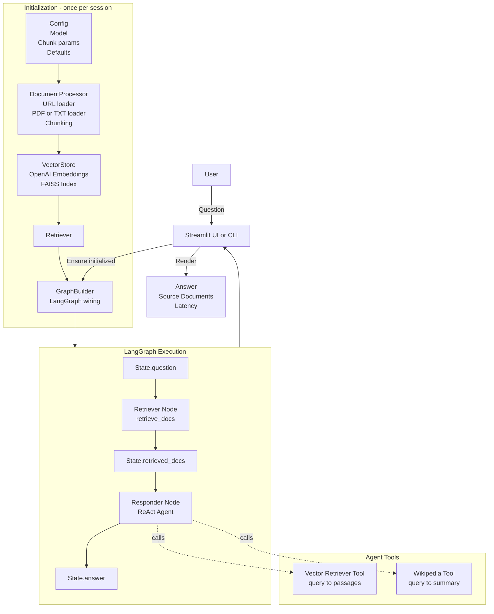

# Architecture

This document describes the architecture of the **Agentic RAG Document Search** system, how data flows through the pipeline, and where to extend it.

---

## High-level overview

The system is a classic RAG pipeline with an **agentic responder**:

1. **Ingest** documents (URLs + local files)
2. **Chunk** documents into retrievable passages
3. **Embed + index** passages in a FAISS vector store
4. **Retrieve** top-k chunks for a user question
5. **Respond** using a **ReAct agent** that can call tools:
   - Vector retriever tool (grounded knowledge)
   - Wikipedia tool (fallback/general knowledge)

---

## System diagram

---

## Components (what each module owns)

### `src/config/`
**Responsibility:** Central configuration
- Model selection and provider setup
- Default URLs / paths
- Chunk sizes, overlaps

### `src/document_ingestion/`
**Responsibility:** Turn raw sources into chunked `Document`s
- URL loading (HTML → text)
- Local file loading (PDF/TXT)
- Chunking strategy (recursive split)
- Metadata normalization (source, page, etc.)

### `src/vectorstore/`
**Responsibility:** Build and expose retrieval
- Embeddings creation
- FAISS index construction
- Retriever interface (top-k, score thresholds)

### `src/state/`
**Responsibility:** Define the graph’s state contract
- `question`
- `retrieved_docs`
- `answer`

### `src/graph_builder/`
**Responsibility:** Orchestration (LangGraph)
- Defines graph nodes and edges
- Produces a runnable graph

### `src/node/`
**Responsibility:** Graph node logic
- Retrieval node (fetch docs)
- Response node (agent/tool execution)

### `streamlit_app.py`
**Responsibility:** UX + session lifecycle
- Initialize system once per session
- Capture user query
- Render answer + sources

### `main.py`
**Responsibility:** CLI runner
- One-shot demo questions
- Optional interactive mode

---

## Data flow (step-by-step)

1. **Startup**
   - UI/CLI boots
   - Config loads model + chunk params

2. **Index build**
   - Ingestion loads URL docs + local docs
   - Splitter chunks documents
   - Embeddings created per chunk
   - FAISS index built

3. **Question answering**
   - User submits a question
   - Retriever node gets top-k chunks
   - Responder node runs ReAct agent
     - Prefers retriever tool for grounded answers
     - Uses Wikipedia tool only when needed
   - UI renders answer and shows retrieved sources

---

## Extension points (how to evolve it like a production system)

- **Persistence:** Save/load FAISS index to avoid rebuilding each run
- **Hybrid retrieval:** Add BM25 + dense reranking
- **Observability:** Log trace, tool calls, retrieval scores, token usage
- **Evaluation:** Add offline eval harness (recall@k, faithfulness)
- **Security:** Add input sanitization + prompt injection defenses
- **Multi-tenant:** Separate indexes per user / dataset

